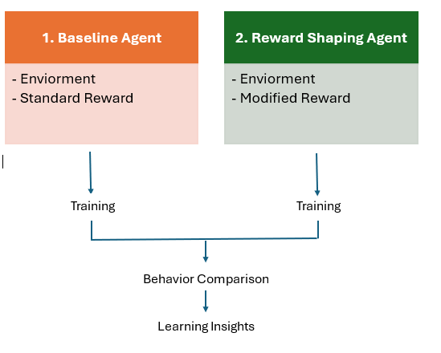

# Reinforcement Learning Reward Shaping
## The Problem

Reinforcement learning agents learn through rewards.

Small changes to reward functions can significantly alter behavior, learning efficiency, stability, and convergence outcomes.

The challenge is not building the model.

The challenge is designing incentives that encourage the desired behavior.

## At a Glance
Deep Q-Network (DQN) implementation
Lunar Lander environment
Baseline vs Reward-Shaped comparison
Custom reward design experiment
TensorFlow / Keras implementation
Experience replay and target networks
Exploration of agent behavior and learning dynamics


## Objective


Evaluate how reward shaping influences:
- Agent behavior
- Learning speed
- Convergence
- Stability
- Landing performance

## Experiment Design
Two agents were trained using identical:
- Environment
- Neural network architecture
- Hyperparameters

Baseline Agent
(Environment Reward)

           vs

Reward-Shaped Agent
(Environment Reward
 + Custom Penalties)

## Experimental Modification

To isolate the impact of reward engineering, all core components remained unchanged between experiments:
- Neural network architecture
- Learning rate
- Discount factor (γ)
- Replay buffer configuration
- Batch size
- Exploration strategy (ε-greedy)
- Target network updates
- Training duration

The reward function was the only modified component.

This allowed behavioral differences to be attributed directly to reward design rather than changes in model architecture or training configuration.

## Training Loop Change

The baseline agent stored the environment reward directly in experience replay:

```diff
while not done:
    action = choose_action(state, epsilon)
    next_state, reward, done, _ = env.step(action)

-   memory.append((state, action, reward, next_state, done))

+   shaped_reward = shape_reward(next_state, reward)
+   memory.append((state, action, shaped_reward, next_state, done))

    state = next_state
    episode_reward += reward
    train_q_network()
```

The original environment reward was retained for performance reporting, while the shaped reward was used during learning.

## Reward Shaping Function

```python
def shape_reward(state, reward):
    x = state[0]
    vy = state[3]
    angle = state[4]

    shaped = reward
    shaped += -0.1 * abs(x)
    shaped += -0.1 * abs(vy)
    shaped += -0.1 * abs(angle)

    return shaped
```
## Reward Formula
R' = Renv - 0.1|x| - 0.1|vy| - 0.1|θ|

Where:
Renv = Original Lunar Lander reward
x = Horizontal position
vy = Vertical velocity
θ = Lander orientation angle

## Intended Behavioral Incentives

The additional penalties were designed to encourage:
- Maintaining a position closer to the landing pad center
- Reducing excessive descent velocity
- Maintaining a more stable orientation throughout flight

Rather than rewarding only the final landing outcome, the reward-shaped agent received additional guidance throughout the descent.


## Repository Structure

```text
├── baseline_dqn.py
├── reward_shaped_dqn.py
├── lunar-lander.png
└── README.md
```


## Source Code

baseline_dqn.py → Original DQN implementation using the environment reward.

reward_shaped_dqn.py → DQN implementation with custom reward shaping.

## Experimental Hypothesis
The shaped reward function would provide additional learning signals during flight and encourage safer, more controlled landing behavior than the baseline reward structure.

## Results
The experiment demonstrated that reward design significantly influenced learned behavior, despite the neural network architecture and training process remaining unchanged.

## Key Observations
- Small reward modifications produced noticeable behavioral changes.
- Additional incentives introduced competing objectives.
- Reward scaling affected learning stability.
- More intuitive rewards did not automatically improve overall performance.
- Behavioral improvements did not always translate into higher cumulative rewards.

# Technical Architecture
```
Environment State
         ↓
Policy Network
         ↓
Action Selection
         ↓
Environment Reward
         ↓
Reward Shaping
         ↓
Experience Replay
         ↓
Network Training
```

## What This Experiment Demonstrates

- Reinforcement Learning Fundamentals
- Deep Q-Networks (DQN)
- Reward Shaping
- Experimental Design
- AI System Evaluation
- Behavioral Analysis
- Hypothesis Testing


## Core Insight

> In reinforcement learning, the reward function defines the behavior being optimized.

This experiment showed that even small changes to incentives can produce meaningful changes in learning outcomes, despite using the same model architecture and training configuration.

Understanding incentive design is often as important as model design.

## Author

Rishi Bharaj

PMP® | Oracle Generative AI Professional | ISO 9001 Lead Auditor

AI Experimentation • Reinforcement Learning • Decision Systems • Process Improvement
Training process

The only difference was reward design.
